readme.md
# Internet Boy Band DataBase  

**Internet boy band database** es una webstory de *ThePudding* la cual de manera audiovisual nos muestra todas las boybands que desde los años 80’s han entrado al “Billboard Hot 100”.  
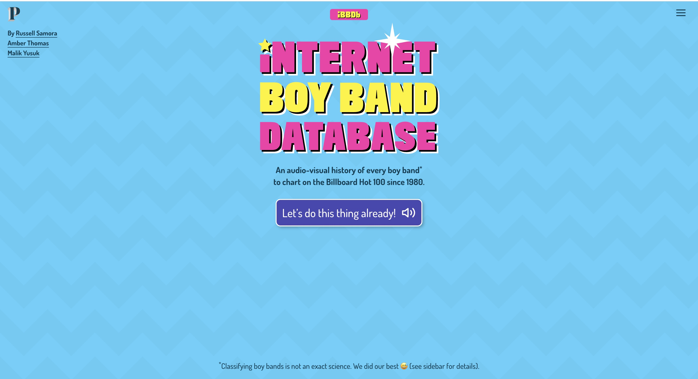

A través de una página interactiva nos lleva en una travesía que empieza con *Musical Youth* en 1983, y termina con *BTS* en 2017.  

En un llamativo fondo de color azul celeste nos induce al mundo de la música, en donde no solamente nos dicen los nombres de las bandas, sino que mientras escuchamos las canciones de fondo, podemos bailar y disfrutar junto a las animaciones de los chicos que nos hacen revivir sus conciertos.  

Desde diferentes accesorios, atuendos personales o cabellos coloridos, que nos hacen reconocer a los chicos, nos ayuda a entrar en esta narrativa la cual va más allá de la música, es un viaje a través de las épocas.  

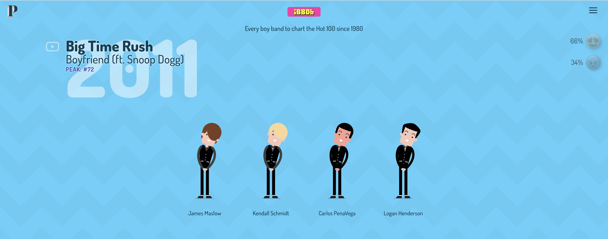

## La interactividad en la webstory

### Borde Izquierdo

Siguiendo la línea visual desde la izquierda a la derecha, lo primero que logramos apreciar es que; al lado de los nombres de las bandas, de los títulos de las canciones y su puesto en el ranking, encontramos un **hipervinculo** para *casi* todas las canciones en YouTube.  

Si todo sale bien, debería pasar esto:
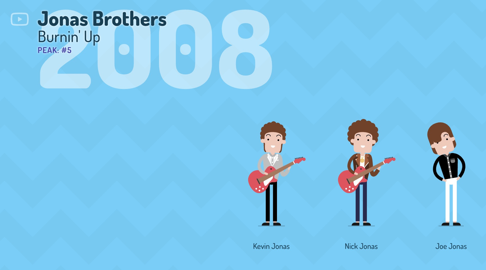
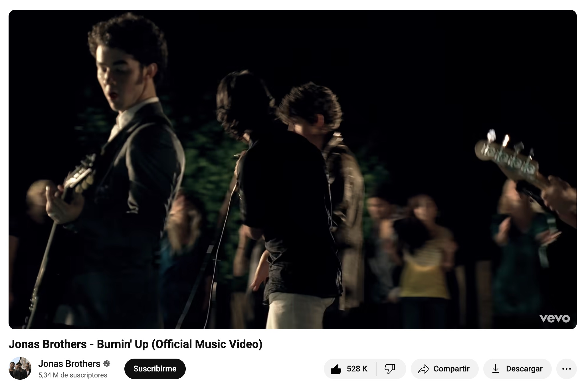

Pero no siempre las cosas salen como deseamos, y a veces este **hipervínculo** no nos lleva a ningún lugar.
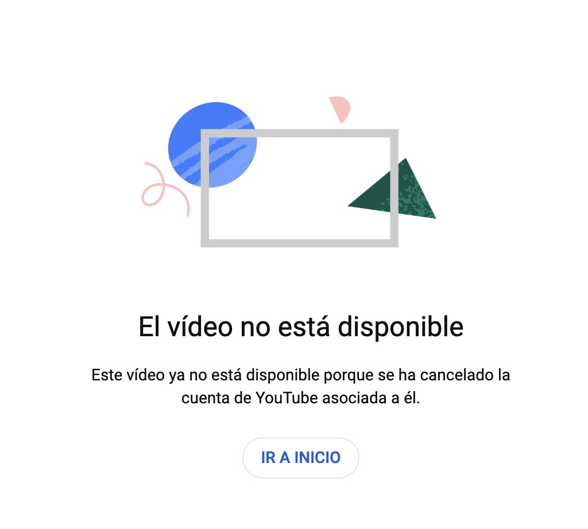
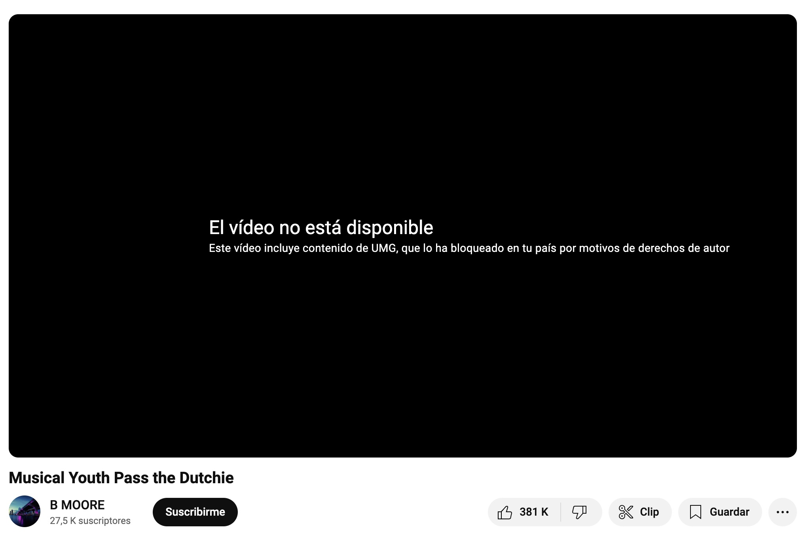

### Borde Derecho

Así siguiendo con todo el costado derecho, en donde encontraremos: 
 

1. #### **El conjunto de 3 barritas**:
El cual nos cuenta el cómo recolectaron la información, los encargados de las animaciones y redacción, y lo más importante… una **playlist de Spotify** (la cual volveremos a mencionar al final).  
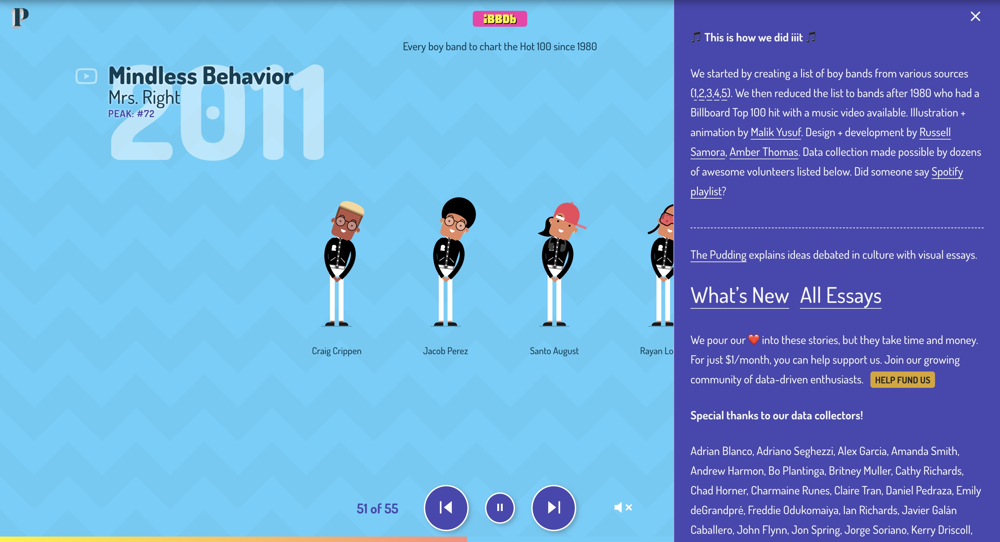

   Para recolectar la información se basaron en **5 sitios web**:  

   1. [The Top 25 Boy Bands Of All Time](https://www.buzzfeed.com/mrloganrhoades/the-top-25-boy-bands-of-all-time)  
   2. [The 100 Greatest Boy Bands Songs of All Time: Critic's Picks](https://www.billboard.com/media/lists/greatest-boy-band-songs-of-all-time-top-100-8362499/)  
   3. [Our Favorite Boy Bands of All Time](https://www.teenvogue.com/gallery/best-boy-bands)  
   4. [Category:American boy bands](https://en.wikipedia.org/wiki/Category:American_boy_bands)  
   5. [The 150+ Best K-pop Groups Of All Time, Ranked](https://www.ranker.com/list/k-pop-bands-and-musicians/ranker-music)  

   En los cuales se realizan **ranking** y análisis de estas mismas bandas pudiendo así llegar a esta línea del tiempo.  

2. #### La dupla de emojis:
 Más abajo nos encontramos con un conjunto de **2 emojis** listos para expresar nuestra opinión:  

   - 😍 para tirar corazones morados 
   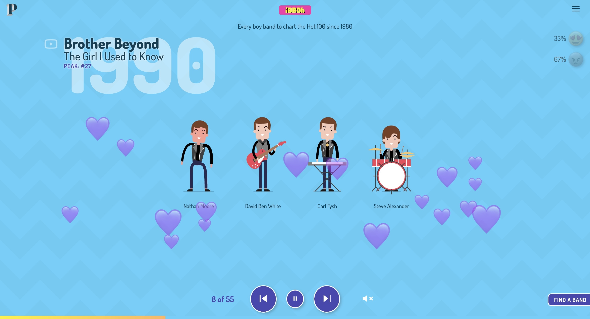
   - 😡 para poder lanzar caca
   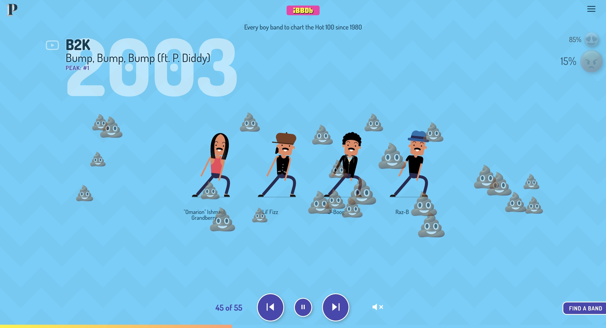

   Así mostrándonos el **% de personas que votan igual o encontrar de nosotros.**  

3. #### ABC Musical:
 **Y, por último**, esquina inferior derecha, encontramos el **listado de las bandas acomodadas en orden alfabético**, de esta manera pudiendo llegar de manera más rápida a nuestra banda favorita.  

## Reflexión final  

La estructura que presentaron hizo que la manera de contar la historia se volviera altamente creativa, pero considero que el haber incluido información extra; como historias de las bandas, algún análisis de las canciones, o de la opinión de la fanaticada, hubieran logrado ser una gran adición, la cual nos ayudarían a poder entrar mejor en este mundo que nos ofrecen.  

Pero la verdad es que tal vez no estén todos los datos necesarios para esto, incluyendo la pregunta de **¿Qué es siquiera una boyband?**  

El trabajo de *ThePudding* no fue solamente hacer esta database con las canciones más conocidas de las boybands, sino que también incluyeron [**link para una playlist de Spotify.**](https://open.spotify.com/playlist/2OJ4Gw6NRcrHGgpQumI88i?si=00ots-50T5qcgXIGnsF9yw)
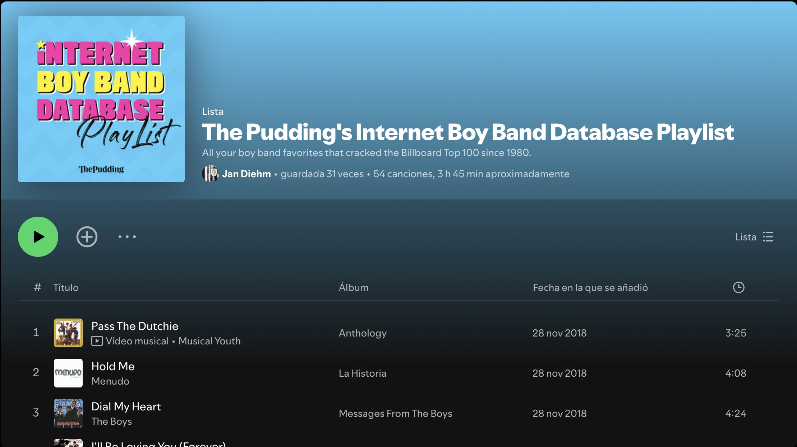

Pero... creo que las Boy Bands han cambiado un poco...
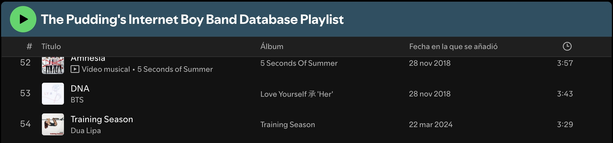

Considero que **todas las bandas estarían orgullosas de estar aquí… o casi todas.** 
<a href="https://www.youtube.com/watch?v=UFC3WvHn_ns&ab_channel=5SOS" target="_blank">
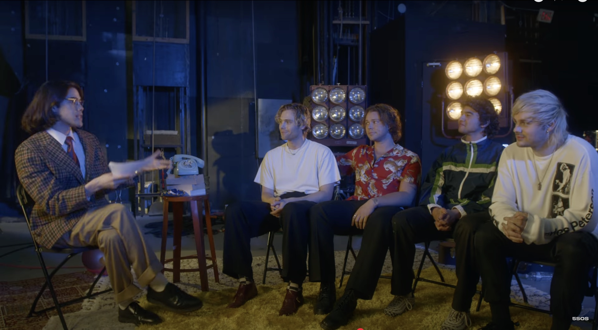
</a>